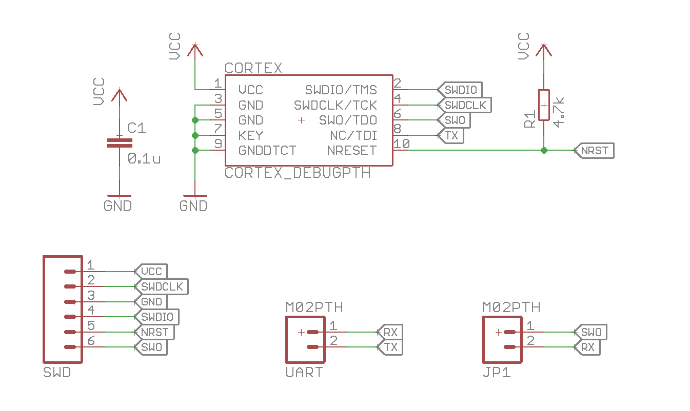
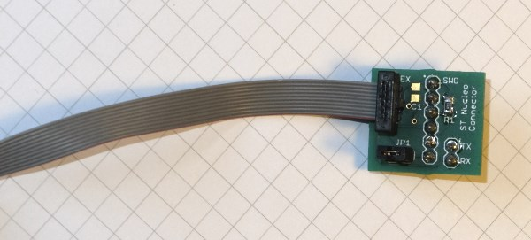
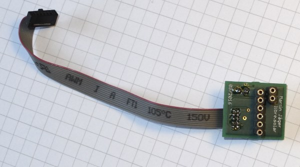

# Cortex ST-Link Adapter

This adapter allows to connect the ST-Link V2 (STM32 Nucleo boards) to be connected to the small 10-pin Cortex standard connectors.

The ST-Link can be used as a serial wire debug (SWD) interface.

## Schematic

The jumper JP1 can be used to connect the SWO pin (serial wire output) to the RX pin of the nucleo board, thus allowing serial communications with MCUs which don't have SWO (Cortex M0 like STM32F072 for example). This works only if the Cortex SWO pin is wired to a TX pin of the MCU, of course.

The pull-up resistor is useful to put NRST to a defined state.

The additional capacitor C1 can be used to stabilize the supply voltage, but might not be necessary.

## Original pictures

### Top side

### Bottom side (fits to ST-Link on Nucleo Board)

